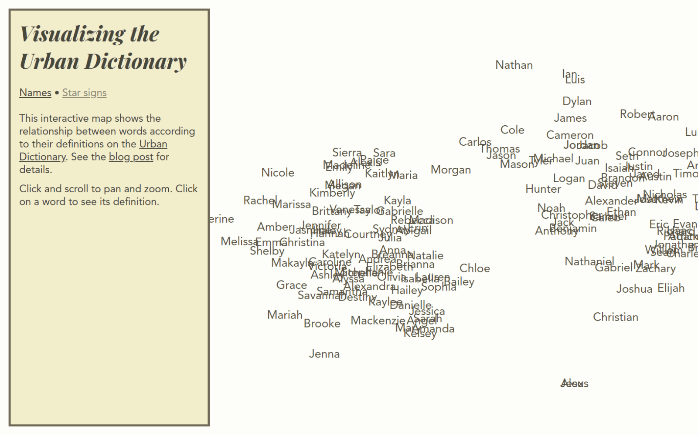

# Visualizing the Urban Dictionary

Visualizing the Urban Dictionary with BERT sentence embeddings and t-SNE

Demo: [visurb.drew.hu](https://visurb.drew.hu) \
Blog post: [blog.drew.hu/visurb](https://blog.drew.hu/visurb)

This repository is split into 2 parts:
* [code](code): Code for generating BERT and t-SNE embeddings, using [sentence-transformers](https://github.com/UKPLab/sentence-transformers) and [scikit-learn](https://github.com/scikit-learn/scikit-learn)
* site (main folder): Code for static site to visualize embeddings using D3.js

### Credits
Special thanks to [Sam Bowman](https://cims.nyu.edu/~sbowman/) for providing advice

This project was inspired by [Font Map](http://fontmap.ideo.com/)

